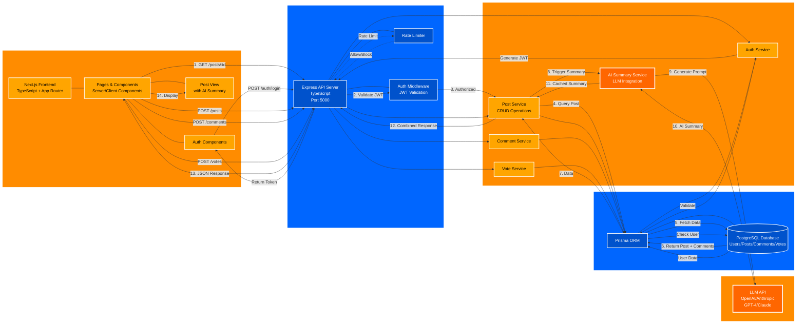

# Reddit Project - Architecture Diagram

## Architecture Overview

### Scope & External Dependencies
- **Client**: Next.js frontend with App Router, Server/Client Components (port 3000)
- **API Server**: Express.js REST API (port 5000)
- **Database**: PostgreSQL with Prisma ORM
- **LLM Service**: External API (OpenAI/Anthropic) for AI summaries

### Key Components
1. **Client Layer**: Next.js App Router with Server/Client Components, SSR/SSG capabilities
2. **API Gateway**: Express server with auth middleware and rate limiting
3. **Business Logic**: Service layer for auth, posts, comments, votes, and AI
4. **Data Layer**: Prisma ORM + PostgreSQL database
5. **External Services**: LLM API for content summarization

### Main Use Case Flow (View Post with AI Summary)
1. User requests post → Frontend calls API
2. API validates JWT token
3. Post Service queries database
4. AI Service generates summary from post + comments
5. LLM API processes prompt and returns summary
6. Combined response (post + summary) returned to user

### LLM Integration Design
- **Component**: Dedicated AI Summary Service
- **API Call**: Made from backend to prevent API key exposure
- **Prompt Generation**: Combines post title, body, and top comments
- **Caching**: Summaries cached to reduce API costs and latency
- **Design Rationale**: Backend handles LLM calls for security, rate limiting, and cost control

