# Reddit Project - Production Architecture Diagram

```mermaid
graph TB
    subgraph USERS[" "]
        direction LR
        User1[👤 Users]
        User2[👤 Users]
        User3[👤 Users]
    end

    subgraph CDN_LAYER["CDN & EDGE LAYER"]
        direction TB
        CDN[Cloudflare/CloudFront CDN<br/>Static Assets, Images<br/>DDoS Protection]
        WAF[Web Application Firewall<br/>SQL Injection, XSS Prevention]
        CDN --- WAF
    end

    subgraph LB_LAYER["LOAD BALANCER LAYER"]
        direction TB
        LB_FE[Load Balancer<br/>Frontend Instances<br/>SSL/TLS Termination]
        LB_API[Load Balancer<br/>API Gateway<br/>Health Checks]
    end

    subgraph FE_LAYER["FRONTEND TIER - Stateless"]
        direction TB
        FE1[Next.js Instance 1<br/>Server Components<br/>:3000]
        FE2[Next.js Instance 2<br/>Server Components<br/>:3000]
        FE3[Next.js Instance N<br/>Auto-Scaling<br/>:3000]
        FE1 -.-> FE2
        FE2 -.-> FE3
    end

    subgraph API_GATEWAY["API GATEWAY TIER - Stateless"]
        direction TB
        API1[Express Instance 1<br/>JWT Validation<br/>:5000]
        API2[Express Instance 2<br/>JWT Validation<br/>:5000]
        API3[Express Instance N<br/>Auto-Scaling<br/>:5000]
        RateLimit[Distributed Rate Limiter<br/>Redis-backed<br/>Per-user & IP Limits]
        API1 --- RateLimit
        API2 --- RateLimit
        API3 --- RateLimit
    end

    subgraph CACHE_LAYER["CACHE LAYER"]
        direction TB
        Redis_Session[Redis Cluster<br/>Session Store<br/>JWT Blacklist]
        Redis_Cache[Redis Cluster<br/>API Response Cache<br/>AI Summary Cache]
        Redis_Queue[Redis<br/>Bull Queue<br/>Job Management]
        Redis_Session -.-> Redis_Cache
        Redis_Cache -.-> Redis_Queue
    end

    subgraph SERVICE_LAYER["BUSINESS LOGIC TIER - Stateless"]
        direction TB
        AuthSvc[Auth Service<br/>Horizontal Scaling]
        PostSvc[Post Service<br/>CRUD + Pagination]
        CommentSvc[Comment Service<br/>Nested Comments]
        VoteSvc[Vote Service<br/>Idempotency Keys]
        CommunitySvc[Community Service<br/>Membership Management]
    end

    subgraph ASYNC_WORKERS["ASYNC WORKER TIER"]
        direction TB
        AIWorker1[AI Worker 1<br/>Summary Generation]
        AIWorker2[AI Worker 2<br/>Summary Generation]
        EmailWorker[Email Worker<br/>Notifications]
        ImageWorker[Image Worker<br/>Processing & Optimization]
        AIWorker1 -.-> AIWorker2
    end

    subgraph DB_LAYER["DATABASE TIER"]
        direction TB
        PG_Primary[(PostgreSQL Primary<br/>Write Operations<br/>Connection Pool: 50)]
        PG_Replica1[(PostgreSQL Replica 1<br/>Read Operations)]
        PG_Replica2[(PostgreSQL Replica 2<br/>Read Operations)]
        PG_Primary -->|Streaming Replication| PG_Replica1
        PG_Primary -->|Streaming Replication| PG_Replica2
        PGBouncer[PgBouncer<br/>Connection Pooling<br/>Query Routing]
        PGBouncer --> PG_Primary
        PGBouncer --> PG_Replica1
        PGBouncer --> PG_Replica2
    end

    subgraph STORAGE["OBJECT STORAGE"]
        S3[S3/Cloud Storage<br/>User Uploads<br/>Images, Attachments<br/>Versioning Enabled]
    end

    subgraph EXTERNAL_SERVICES["EXTERNAL SERVICES"]
        LLM_Primary[OpenAI API<br/>GPT-4o<br/>Primary LLM]
        LLM_Fallback[Anthropic API<br/>Claude 3.5<br/>Fallback LLM]
        EmailSvc[SendGrid/SES<br/>Email Delivery]
    end

    subgraph MONITORING["OBSERVABILITY & MONITORING"]
        direction TB
        APM[APM: Datadog/New Relic<br/>Performance Monitoring]
        Logs[ELK/Loki Stack<br/>Centralized Logging]
        Metrics[Prometheus + Grafana<br/>Metrics & Alerting]
        Tracing[Jaeger/Tempo<br/>Distributed Tracing]
        APM --- Logs
        Logs --- Metrics
        Metrics --- Tracing
    end

    subgraph ORCHESTRATION["CONTAINER ORCHESTRATION"]
        K8S[Kubernetes<br/>Container Management<br/>Auto-scaling, Self-healing<br/>Rolling Deployments]
    end

    subgraph CICD["CI/CD PIPELINE"]
        GitHub[GitHub Actions<br/>Automated Testing<br/>Security Scanning]
        Docker[Docker Registry<br/>Container Images]
        GitHub --> Docker
    end

    subgraph BACKUP["BACKUP & DR"]
        Backup[Automated Backups<br/>PostgreSQL: Daily<br/>Redis: Point-in-Time<br/>S3: Cross-Region]
    end

    %% User Flow
    User1 --> CDN
    User2 --> CDN
    User3 --> CDN
    CDN --> WAF
    WAF --> LB_FE
    WAF --> LB_API

    %% Frontend Flow
    LB_FE --> FE1
    LB_FE --> FE2
    LB_FE --> FE3
    FE1 --> LB_API
    FE2 --> LB_API
    FE3 --> LB_API

    %% API Gateway Flow
    LB_API --> API1
    LB_API --> API2
    LB_API --> API3

    %% Service Layer Communication
    API1 --> Redis_Session
    API2 --> Redis_Session
    API3 --> Redis_Session
    API1 --> Redis_Cache
    API2 --> Redis_Cache
    API3 --> Redis_Cache

    API1 --> AuthSvc
    API1 --> PostSvc
    API1 --> CommentSvc
    API1 --> VoteSvc
    API1 --> CommunitySvc
    API2 --> AuthSvc
    API2 --> PostSvc
    API2 --> CommentSvc
    API2 --> VoteSvc
    API2 --> CommunitySvc

    %% Database Communication
    AuthSvc --> PGBouncer
    PostSvc --> PGBouncer
    CommentSvc --> PGBouncer
    VoteSvc --> PGBouncer
    CommunitySvc --> PGBouncer

    %% Async Processing
    PostSvc -->|Enqueue AI Job| Redis_Queue
    CommentSvc -->|Enqueue AI Job| Redis_Queue
    Redis_Queue --> AIWorker1
    Redis_Queue --> AIWorker2
    Redis_Queue --> EmailWorker
    Redis_Queue --> ImageWorker

    %% Workers to External Services
    AIWorker1 -->|Circuit Breaker| LLM_Primary
    AIWorker1 -.->|Fallback| LLM_Fallback
    AIWorker2 -->|Circuit Breaker| LLM_Primary
    AIWorker2 -.->|Fallback| LLM_Fallback
    AIWorker1 --> Redis_Cache
    AIWorker2 --> Redis_Cache
    EmailWorker --> EmailSvc
    ImageWorker --> S3

    %% Storage
    PostSvc --> S3
    FE1 --> S3
    FE2 --> S3
    FE3 --> S3

    %% Monitoring Connections
    FE1 -.->|Metrics| Metrics
    API1 -.->|Metrics| Metrics
    AuthSvc -.->|Metrics| Metrics
    PostSvc -.->|Traces| Tracing
    AIWorker1 -.->|Logs| Logs
    PG_Primary -.->|Metrics| Metrics
    Redis_Cache -.->|Metrics| Metrics

    %% Orchestration
    K8S -.->|Manages| FE_LAYER
    K8S -.->|Manages| API_GATEWAY
    K8S -.->|Manages| SERVICE_LAYER
    K8S -.->|Manages| ASYNC_WORKERS

    %% CI/CD
    GitHub -.->|Deploy| K8S

    %% Backup
    PG_Primary -.->|Backup| Backup
    Redis_Cache -.->|Backup| Backup
    S3 -.->|Replicate| Backup

    %% Styling - Production Grade Colors
    style USERS fill:#2C3E50,stroke:#ECF0F1,stroke-width:3px,color:#ECF0F1
    style CDN_LAYER fill:#E74C3C,stroke:#ECF0F1,stroke-width:3px,color:#ECF0F1
    style LB_LAYER fill:#3498DB,stroke:#ECF0F1,stroke-width:3px,color:#ECF0F1
    style FE_LAYER fill:#1ABC9C,stroke:#ECF0F1,stroke-width:3px,color:#ECF0F1
    style API_GATEWAY fill:#9B59B6,stroke:#ECF0F1,stroke-width:3px,color:#ECF0F1
    style CACHE_LAYER fill:#E67E22,stroke:#ECF0F1,stroke-width:3px,color:#ECF0F1
    style SERVICE_LAYER fill:#16A085,stroke:#ECF0F1,stroke-width:3px,color:#ECF0F1
    style ASYNC_WORKERS fill:#F39C12,stroke:#ECF0F1,stroke-width:3px,color:#000000
    style DB_LAYER fill:#2980B9,stroke:#ECF0F1,stroke-width:3px,color:#ECF0F1
    style STORAGE fill:#27AE60,stroke:#ECF0F1,stroke-width:3px,color:#ECF0F1
    style EXTERNAL_SERVICES fill:#8E44AD,stroke:#ECF0F1,stroke-width:3px,color:#ECF0F1
    style MONITORING fill:#C0392B,stroke:#ECF0F1,stroke-width:3px,color:#ECF0F1
    style ORCHESTRATION fill:#34495E,stroke:#ECF0F1,stroke-width:3px,color:#ECF0F1
    style CICD fill:#16A085,stroke:#ECF0F1,stroke-width:3px,color:#ECF0F1
    style BACKUP fill:#7F8C8D,stroke:#ECF0F1,stroke-width:3px,color:#ECF0F1

    style CDN fill:#E74C3C,stroke:#ECF0F1,stroke-width:2px,color:#FFFFFF
    style WAF fill:#C0392B,stroke:#ECF0F1,stroke-width:2px,color:#FFFFFF
    style LB_FE fill:#3498DB,stroke:#ECF0F1,stroke-width:2px,color:#FFFFFF
    style LB_API fill:#2980B9,stroke:#ECF0F1,stroke-width:2px,color:#FFFFFF
    style Redis_Session fill:#DC7633,stroke:#ECF0F1,stroke-width:2px,color:#FFFFFF
    style Redis_Cache fill:#E67E22,stroke:#ECF0F1,stroke-width:2px,color:#FFFFFF
    style Redis_Queue fill:#CA6F1E,stroke:#ECF0F1,stroke-width:2px,color:#FFFFFF
    style RateLimit fill:#8E44AD,stroke:#ECF0F1,stroke-width:2px,color:#FFFFFF
    style PGBouncer fill:#1F618D,stroke:#ECF0F1,stroke-width:2px,color:#FFFFFF
    style K8S fill:#326CE5,stroke:#ECF0F1,stroke-width:3px,color:#FFFFFF
```



---

## 🏗️ Production Architecture Overview

### Design Principles
- **Horizontal Scalability**: All application tiers are stateless and can scale horizontally
- **High Availability**: No single points of failure, multi-AZ deployment
- **Security-First**: Defense in depth with WAF, encryption, secrets management
- **Observability**: Comprehensive monitoring, logging, tracing, and alerting
- **Cost Optimization**: Efficient resource usage with auto-scaling and caching
- **Resilience**: Circuit breakers, retries, fallbacks, and graceful degradation

---

## 📊 Architecture Layers (Top to Bottom)

### 1. **Edge & Security Layer**
**Purpose**: Global content delivery, DDoS protection, and security filtering

- **CDN (CloudFront/Cloudflare)**
  - Static assets (JS, CSS, images) cached at edge locations
  - 90%+ reduction in origin server load
  - HTTPS everywhere with automatic certificate management
  - Geographic distribution for <100ms latency globally

- **Web Application Firewall (WAF)**
  - OWASP Top 10 protection (SQL injection, XSS, CSRF)
  - Rate limiting at edge (1000 req/min per IP)
  - Bot detection and mitigation
  - DDoS protection up to Layer 7

**Handles**: 100k+ concurrent users, 1M+ requests/hour

---

### 2. **Load Balancer Layer**
**Purpose**: Distribute traffic across multiple application instances

- **Application Load Balancers (ALB)**
  - SSL/TLS termination (TLS 1.3)
  - Health checks every 10 seconds
  - Automatic failover to healthy instances
  - WebSocket support for real-time features
  - Sticky sessions when needed (JWT makes this unnecessary)

- **Configuration**
  - Cross-zone load balancing enabled
  - Connection draining: 300 seconds
  - Idle timeout: 60 seconds
  - Target groups: Frontend (3000), API (5000)

**Handles**: 50k requests/second per LB

---

### 3. **Frontend Tier (Next.js) - Stateless**
**Purpose**: Server-side rendering, API orchestration, and client delivery

- **Next.js App Router Instances**
  - Server Components for improved performance
  - Static generation (SSG) for public pages
  - Server-side rendering (SSR) for dynamic content
  - Automatic code splitting and lazy loading
  - Image optimization with Next.js Image component

- **Scaling Strategy**
  - Horizontal Pod Autoscaler (HPA): 3-20 pods
  - CPU threshold: 70%
  - Memory threshold: 80%
  - Scale up: 2 pods/min, Scale down: 1 pod/5min

- **Container Specs**
  - CPU: 1 vCPU per instance
  - Memory: 2GB per instance
  - Node.js 20 LTS

**Handles**: 1k requests/sec per instance

---

### 4. **API Gateway Tier (Express) - Stateless**
**Purpose**: API request routing, authentication, and rate limiting

- **Express.js API Instances**
  - JWT validation middleware (RS256)
  - Request validation with Zod/Joi schemas
  - Helmet.js for security headers
  - CORS configuration (whitelist origins)
  - Response compression (gzip/brotli)

- **Distributed Rate Limiter (Redis-backed)**
  - Per-user limits: 100 req/min authenticated, 20 req/min anonymous
  - Per-endpoint limits: POST /posts: 10/hour per user
  - AI summary requests: 50/day per user
  - Sliding window algorithm for accuracy

- **Authentication Strategy**
  - JWT tokens (15min expiry, refresh tokens 7 days)
  - Token blacklist in Redis for logout
  - Rate limit on /auth/* endpoints: 5 req/min

- **Scaling Strategy**
  - HPA: 3-30 pods
  - CPU threshold: 60%
  - Memory threshold: 75%

- **Container Specs**
  - CPU: 0.5 vCPU per instance
  - Memory: 1GB per instance

**Handles**: 2k requests/sec per instance

---

### 5. **Cache Layer (Redis Cluster)**
**Purpose**: Reduce database load, improve response times, and manage state

- **Redis Session Store**
  - JWT blacklist (logout functionality)
  - Active session tracking
  - TTL: Match JWT expiry (15 minutes)

- **Redis API Cache**
  - Hot data: Popular posts, trending communities
  - AI summaries (expensive to regenerate)
  - User profiles (read-heavy)
  - TTL strategy:
    - Post data: 5 minutes
    - AI summaries: 24 hours
    - User profiles: 15 minutes
  - Cache invalidation on write operations

- **Redis Queue (Bull)**
  - Job queues for async operations
  - Priority queues (AI jobs: high, emails: low)
  - Job retry logic: 3 attempts with exponential backoff
  - Dead letter queue for failed jobs

- **Configuration**
  - Redis Cluster mode: 3 masters, 3 replicas
  - Persistence: RDB snapshots every 5 minutes + AOF
  - Eviction policy: `allkeys-lru`
  - Max memory: 16GB per node

**Performance**
- Cache hit ratio target: >85%
- Latency: <1ms for cache hits
- Throughput: 100k ops/sec per node

---

### 6. **Business Logic Tier (Services) - Stateless**
**Purpose**: Core business logic, data validation, and orchestration

**Services**:

1. **Auth Service**
   - User registration with bcrypt (cost: 12)
   - Login with rate limiting
   - Password reset workflow
   - JWT generation and validation

2. **Post Service**
   - CRUD operations with authorization checks
   - Pagination (cursor-based for performance)
   - Full-text search (PostgreSQL tsvector)
   - Trigger AI summary jobs for new posts

3. **Comment Service**
   - Nested comment support (adjacency list model)
   - Pagination with depth limiting (max depth: 10)
   - Comment editing (mark as edited)
   - Delete cascade handling

4. **Vote Service**
   - Upvote/downvote with idempotency keys
   - Vote change handling (up→down, down→up)
   - Vote count caching in Redis
   - Prevent vote manipulation (rate limits)

5. **Community Service**
   - Community creation with uniqueness validation
   - Membership management
   - Moderator role assignment
   - Community settings and rules

**Design Patterns**
- Repository pattern for data access
- Service layer for business logic
- DTOs for data transfer
- Error handling with custom exceptions
- Input validation at service layer

**Container Specs** (per service type)
- CPU: 0.5-1 vCPU
- Memory: 512MB-1GB
- HPA: 2-15 pods per service

---

### 7. **Async Worker Tier**
**Purpose**: Handle long-running and background tasks asynchronously

**Workers**:

1. **AI Worker** (2-10 instances based on load)
   - Pull jobs from Redis queue
   - Generate AI summaries for posts + comments
   - Circuit breaker pattern:
     - Failure threshold: 50%
     - Timeout: 30 seconds
     - Half-open retry: 60 seconds
   - Automatic fallback: OpenAI → Anthropic
   - Cache summaries in Redis (24-hour TTL)
   - Retry logic: 3 attempts with exponential backoff

2. **Email Worker** (2-5 instances)
   - Welcome emails
   - Password reset emails
   - Notification emails (configurable preferences)
   - Template rendering
   - Batch processing for efficiency

3. **Image Worker** (2-5 instances)
   - Image validation (file type, size, dimensions)
   - Image optimization (WebP conversion)
   - Thumbnail generation (multiple sizes)
   - Upload to S3/Cloud Storage
   - EXIF data sanitization (privacy)

**Benefits of Async Processing**
- Non-blocking API responses
- Better resource utilization
- Retry and error handling
- Priority-based execution
- Scalability under load

---

### 8. **Database Tier (PostgreSQL)**
**Purpose**: Persistent data storage with high availability and read scalability

**Primary Database**
- PostgreSQL 15
- Write operations only
- Connection pool: 50 connections via PgBouncer
- VACUUM and ANALYZE scheduled maintenance
- Point-in-Time Recovery (PITR) enabled

**Read Replicas** (2+ instances)
- Streaming replication (synchronous for critical data)
- Read-only queries (SELECT operations)
- Load distributed by PgBouncer
- Failover promotion capability

**PgBouncer (Connection Pooler)**
- Pool mode: Transaction pooling
- Max connections: 500
- Query routing: Writes→Primary, Reads→Replicas
- Connection reuse for efficiency

**Database Optimizations**
- Indexes on frequently queried columns:
  - Posts: `community_id`, `author_id`, `created_at`
  - Comments: `post_id`, `parent_comment_id`, `author_id`
  - Votes: Composite index `(user_id, target_type, target_id)`
- Partial indexes for active data
- B-tree indexes for equality/range queries
- GIN indexes for full-text search (`tsvector`)

**Partitioning Strategy** (for scale)
- Posts table: Partition by `created_at` (monthly)
- Votes table: Partition by `created_at` (quarterly)
- Archive old partitions to cold storage

**Performance Targets**
- Read latency: <10ms (p95)
- Write latency: <50ms (p95)
- Throughput: 5k queries/sec (mixed workload)

**High Availability**
- Multi-AZ deployment
- Automatic failover: <30 seconds
- Backup retention: 30 days
- RPO (Recovery Point Objective): 5 minutes
- RTO (Recovery Time Objective): 15 minutes

---

### 9. **Object Storage (S3/Cloud Storage)**
**Purpose**: Scalable storage for user-generated content

**Configuration**
- Bucket organization:
  - `/uploads/images/` - User uploaded images
  - `/uploads/attachments/` - Post attachments
  - `/avatars/` - User profile pictures
  - `/backups/` - Database and Redis backups

**Security**
- Private buckets with signed URLs
- Presigned URL expiry: 15 minutes for uploads
- Public read access via CloudFront only
- Versioning enabled
- Server-side encryption (AES-256)

**Lifecycle Policies**
- Transition to Glacier after 90 days (old attachments)
- Delete incomplete multipart uploads after 7 days
- Versioning cleanup after 30 days

**Performance**
- CDN integration for global delivery
- Transfer acceleration for uploads
- Multipart upload for files >100MB

---

### 10. **External Services**

**LLM APIs** (OpenAI & Anthropic)
- **Primary**: OpenAI GPT-4o
  - Max tokens: 4096 output
  - Temperature: 0.3 (deterministic summaries)
  - Timeout: 30 seconds
  
- **Fallback**: Anthropic Claude 3.5 Sonnet
  - Activated on primary failure or high latency
  - Same prompt engineering approach
  - Independent rate limits

- **Cost Optimization**
  - Aggressive caching (24-hour TTL)
  - Batch processing when possible
  - Prompt engineering for conciseness
  - Token usage monitoring and alerts

- **Security**
  - API keys in secrets manager (AWS Secrets Manager/HashiCorp Vault)
  - Rotation every 90 days
  - Network egress control

**Email Service** (SendGrid/AWS SES)
- Transactional emails only
- SPF, DKIM, DMARC configured
- Bounce and complaint handling
- Unsubscribe management

---

### 11. **Observability & Monitoring**
**Purpose**: Proactive issue detection, performance monitoring, and debugging

**Components**:

1. **APM (Application Performance Monitoring)**
   - Tool: Datadog / New Relic
   - Metrics: Response times, error rates, throughput
   - Distributed tracing across services
   - Custom business metrics (posts/hour, AI summaries generated)
   - Real-user monitoring (RUM) for frontend

2. **Centralized Logging**
   - Stack: ELK (Elasticsearch, Logstash, Kibana) or Loki + Grafana
   - Log levels: ERROR, WARN, INFO, DEBUG
   - Structured logging (JSON format)
   - Log retention: 30 days hot, 90 days cold
   - Log aggregation from all services

3. **Metrics & Alerting**
   - Stack: Prometheus + Grafana
   - System metrics: CPU, memory, disk, network
   - Application metrics: Request rates, error rates, latency (RED method)
   - Database metrics: Connection pool, query performance, replication lag
   - Cache metrics: Hit rate, eviction rate, memory usage

4. **Distributed Tracing**
   - Tool: Jaeger / Tempo
   - Trace IDs propagated across all services
   - Span tagging for debugging
   - Performance bottleneck identification
   - Service dependency mapping

**Alerting Strategy**
- **Critical Alerts** (PagerDuty, immediate response):
  - Service downtime (>5% error rate)
  - Database replication lag >60 seconds
  - Cache hit rate <50%
  - LLM API failures >20%

- **Warning Alerts** (Slack, investigate within 1 hour):
  - High latency (p95 >1 second)
  - Disk usage >80%
  - High memory usage >90%
  - Abnormal traffic patterns

**Dashboards**
- Executive: High-level KPIs (uptime, users, revenue impact)
- Engineering: Service health, error rates, latency
- Database: Query performance, connection pools, replication
- Cost: Resource usage, LLM API costs, storage costs

---

### 12. **Container Orchestration (Kubernetes)**
**Purpose**: Automated deployment, scaling, and management of containerized applications

**Configuration**:
- **Cluster Setup**
  - Multi-AZ deployment across 3 availability zones
  - Node pools: General purpose (app tier), Memory-optimized (cache), CPU-optimized (workers)
  - Kubernetes version: Latest stable (n-1)

- **Auto-scaling**
  - Horizontal Pod Autoscaler (HPA) for application pods
  - Vertical Pod Autoscaler (VPA) for resource optimization
  - Cluster Autoscaler for node scaling
  - KEDA for event-driven scaling (queue depth)

- **Deployment Strategy**
  - Rolling updates with zero downtime
  - Canary deployments for risky changes (5% → 50% → 100%)
  - Blue-green deployments for major releases
  - Automatic rollback on health check failures

- **Resource Management**
  - Resource requests and limits defined for all pods
  - Quality of Service (QoS) classes: Guaranteed for critical services
  - Pod disruption budgets (PDB) to maintain availability
  - Node affinity and anti-affinity rules

- **Service Mesh (Istio/Linkerd)** - Optional but Recommended
  - mTLS between services
  - Traffic management and routing
  - Circuit breaking and retries
  - Observability (automatic metrics)

**Security**
- Network policies for pod-to-pod communication
- Pod security policies/standards
- Secrets management (External Secrets Operator)
- RBAC for access control
- Regular security scanning (Trivy, Falco)

---

### 13. **CI/CD Pipeline**
**Purpose**: Automated testing, building, and deployment

**Pipeline Stages**:

1. **Code Quality & Security**
   - Linting (ESLint, Prettier)
   - Type checking (TypeScript)
   - Unit tests (Jest, Vitest) - 80% coverage minimum
   - Integration tests (Supertest for API)
   - SAST (Static Application Security Testing) - Snyk, SonarQube
   - Dependency vulnerability scanning (npm audit, Dependabot)

2. **Build & Package**
   - Docker image build (multi-stage builds for size optimization)
   - Image scanning (Trivy, Clair)
   - Tag images with commit SHA and version
   - Push to container registry (ECR, GCR, Docker Hub)

3. **Environment Progression**
   - **Development**: Auto-deploy on merge to `develop` branch
   - **Staging**: Auto-deploy on merge to `staging` branch
   - **Production**: Manual approval required, deploy from `main` branch

4. **Post-Deployment**
   - Smoke tests (health check endpoints)
   - Database migration execution (Prisma migrate)
   - Cache warming for critical data
   - Monitoring and alerting validation

5. **Rollback Capability**
   - Automated rollback on critical errors
   - Manual rollback via Kubernetes deployment history
   - Database migration rollback scripts

**Tools**:
- GitHub Actions / GitLab CI / CircleCI
- Helm for Kubernetes deployments
- ArgoCD / Flux for GitOps (optional)

---

### 14. **Backup & Disaster Recovery**
**Purpose**: Data protection and business continuity

**Backup Strategy**:

1. **Database Backups**
   - Automated daily full backups
   - Continuous WAL (Write-Ahead Log) archiving
   - Point-in-Time Recovery capability (7-day window)
   - Backup testing: Monthly restore validation
   - Cross-region replication for disaster recovery
   - Retention: 30 days production, 7 days staging

2. **Redis Backups**
   - RDB snapshots every 6 hours
   - AOF (Append-Only File) for durability
   - Replication to standby cluster
   - Retention: 7 days

3. **Object Storage**
   - S3 versioning enabled (accidental delete protection)
   - Cross-region replication (disaster recovery)
   - Glacier transition after 90 days (cost optimization)
   - Object lock for compliance (immutable backups)

**Disaster Recovery Plan**:
- **RPO (Recovery Point Objective)**: 5 minutes (maximum acceptable data loss)
- **RTO (Recovery Time Objective)**: 15 minutes (maximum downtime)
- **Multi-Region Failover**: Active-passive setup in secondary region
- **Runbook**: Documented procedures for failover and recovery
- **DR Testing**: Quarterly failover drills

---

## 🔐 Security Hardening

### Defense in Depth Layers:

1. **Network Security**
   - VPC isolation with public/private subnets
   - Security groups with least privilege rules
   - Network ACLs for subnet-level filtering
   - VPN or AWS PrivateLink for admin access
   - No direct internet access to databases

2. **Application Security**
   - Input validation and sanitization (Zod schemas)
   - Output encoding to prevent XSS
   - Parameterized queries to prevent SQL injection
   - CSRF protection with SameSite cookies
   - Content Security Policy (CSP) headers
   - Rate limiting and brute force protection

3. **Authentication & Authorization**
   - JWT with RS256 (asymmetric signing)
   - Short-lived access tokens (15 min)
   - Refresh token rotation
   - Password hashing with bcrypt (cost: 12)
   - Multi-factor authentication (TOTP) - optional
   - Role-based access control (RBAC)

4. **Data Security**
   - Encryption at rest (AES-256)
   - Encryption in transit (TLS 1.3)
   - Database connection encryption
   - Secrets management (AWS Secrets Manager, Vault)
   - PII data handling and GDPR compliance
   - Audit logging for sensitive operations

5. **API Security**
   - API key rotation every 90 days
   - Request signing for external APIs
   - Rate limiting per API key/user
   - API versioning to prevent breaking changes
   - GraphQL query depth limiting (if applicable)

6. **Monitoring & Incident Response**
   - Intrusion detection system (IDS)
   - Security information and event management (SIEM)
   - Automated security alerts
   - Incident response playbook
   - Regular penetration testing (quarterly)
   - Bug bounty program (when mature)

---

## 📈 Scalability Metrics & Targets

### Expected Load Capacity:

| Metric | Target | Current Capacity |
|--------|--------|------------------|
| **Concurrent Users** | 100,000+ | ~150,000 with current setup |
| **Requests per Second** | 10,000+ | ~15,000 peak |
| **Database Queries/sec** | 50,000 | ~75,000 with read replicas |
| **Cache Hit Rate** | >85% | Monitored via Prometheus |
| **API Latency (p95)** | <200ms | Target with caching |
| **AI Summary Generation** | <5 seconds | With fallback LLM |
| **Uptime SLA** | 99.9% (43min downtime/month) | Multi-AZ deployment |

### Auto-Scaling Triggers:

| Component | Scale Up Threshold | Scale Down Threshold | Min | Max |
|-----------|-------------------|---------------------|-----|-----|
| Frontend | CPU >70% or Memory >80% | CPU <30% for 5min | 3 | 20 |
| API Gateway | CPU >60% or Memory >75% | CPU <25% for 5min | 3 | 30 |
| Services | CPU >70% or Memory >80% | CPU <30% for 10min | 2 | 15 |
| AI Workers | Queue depth >100 jobs | Queue depth <10 jobs | 2 | 10 |
| Database | Read replica lag >30s | Manual scale-down | 2 replicas | 5 replicas |

---

## 💰 Cost Optimization Strategies

1. **Right-Sizing Resources**
   - Regular review of pod resource usage (VPA recommendations)
   - Reserved instances for baseline capacity (40% cost savings)
   - Spot instances for fault-tolerant workers (70% cost savings)

2. **Caching Strategy**
   - Aggressive caching reduces database load by 60-80%
   - CDN caching eliminates 90%+ origin requests
   - AI summary caching saves ~$2,000/month in LLM costs

3. **Storage Lifecycle**
   - Move old attachments to Glacier (80% storage cost reduction)
   - Compress logs before archiving
   - Delete old logs after retention period

4. **Database Optimization**
   - Connection pooling reduces database instance size requirements
   - Read replicas handle 80% of queries (cheaper than scaling primary)
   - Partitioning and archiving old data

5. **Monitoring & Alerts**
   - Cost anomaly detection
   - Budget alerts at 80%, 90%, 100%
   - Regular cost reviews and optimization sprints

**Estimated Monthly Costs** (for 100k users, 10M requests/day):
- Compute (Kubernetes, containers): $3,000-5,000
- Database (PostgreSQL managed): $1,500-2,500
- Cache (Redis managed): $500-800
- Storage (S3): $300-500
- CDN & Bandwidth: $1,000-2,000
- LLM APIs (OpenAI): $1,500-3,000 (with aggressive caching)
- Monitoring & Logging: $500-1,000
- **Total**: ~$8,300-15,000/month

---

## 🚀 Performance Optimization Techniques

### Frontend Optimizations:
- **Code Splitting**: Load only necessary code per route
- **Tree Shaking**: Eliminate unused code in production builds
- **Image Optimization**: WebP format, lazy loading, responsive images
- **Static Generation**: Pre-render popular pages at build time
- **Incremental Static Regeneration**: Update static pages without full rebuild
- **Client-Side Caching**: React Query / SWR for data caching
- **Bundle Size**: Keep initial bundle <200KB gzipped

### API Optimizations:
- **Response Compression**: Gzip/Brotli reduces bandwidth by 70-80%
- **Pagination**: Cursor-based pagination for large datasets
- **Field Selection**: GraphQL or field filtering to reduce payload size
- **Database Query Optimization**: Analyze slow queries, add indexes
- **N+1 Query Prevention**: Use DataLoader or eager loading
- **Connection Pooling**: Reuse database connections
- **Async Operations**: Non-blocking I/O with Promises/async-await

### Database Optimizations:
- **Query Optimization**: Use EXPLAIN ANALYZE for slow queries
- **Proper Indexing**: Cover frequently queried columns
- **Materialized Views**: Pre-compute complex aggregations
- **Partitioning**: Split large tables for faster queries
- **Denormalization**: Strategic duplication for read-heavy operations
- **Caching**: Cache query results in Redis for hot data

### Caching Strategy:
- **Cache-Aside Pattern**: Application checks cache, falls back to database
- **Write-Through Cache**: Update cache immediately on writes
- **TTL Strategy**: Short TTLs for dynamic data, long TTLs for static data
- **Cache Warming**: Pre-populate cache with hot data on deployment
- **Cache Invalidation**: Invalidate on writes, use cache tags for related data

---

## 🔄 Data Flow Example: User Views Post with AI Summary

```
1. User requests post → CDN (static assets cached)
2. Request hits WAF → Security checks pass
3. Load Balancer → Routes to healthy Frontend instance
4. Frontend SSR → Calls API Gateway
5. Load Balancer → Routes to healthy API instance
6. API Gateway → Validates JWT from Redis session store
7. API → Checks Redis cache for post data
   - Cache HIT → Return cached data (1-2ms latency) ✅
   - Cache MISS → Continue to database
8. Post Service → Queries PgBouncer
9. PgBouncer → Routes SELECT to read replica
10. Read Replica → Returns post + comments (10-20ms latency)
11. Post Service → Checks Redis for AI summary
    - Summary EXISTS → Return cached summary ✅
    - Summary MISSING → Enqueue AI job to Redis Queue
12. AI Worker → Pulls job from queue (async)
13. AI Worker → Generates prompt from post + top comments
14. AI Worker → Calls OpenAI API with circuit breaker
    - SUCCESS → Cache summary in Redis (24hr TTL)
    - FAILURE → Fallback to Anthropic API
    - BOTH FAIL → Return graceful error message
15. API → Combines post + summary → Returns JSON
16. Frontend → Renders post with AI summary
17. Metrics → Logged to Prometheus, traces to Jaeger

Total Latency:
- Cache HIT: 50-100ms (optimal)
- Cache MISS (no AI): 200-300ms
- Cache MISS (with AI generation): 3-5 seconds (async, shows loading state)
```

---

## 🎯 Implementation Roadmap

### Phase 1: MVP (Current State)
- ✅ Basic frontend and backend
- ✅ Database schema with Prisma
- ✅ User authentication
- ✅ CRUD operations for posts/comments

### Phase 2: Production Readiness (3-6 months)
- [ ] Containerize applications (Docker)
- [ ] Set up Kubernetes cluster
- [ ] Implement Redis caching layer
- [ ] Add PgBouncer and read replicas
- [ ] Implement LLM integration with circuit breaker
- [ ] Set up monitoring (Prometheus + Grafana)
- [ ] Configure load balancers
- [ ] Set up CI/CD pipeline
- [ ] Implement comprehensive logging
- [ ] Security hardening (WAF, rate limiting, input validation)

### Phase 3: Scale & Optimize (6-12 months)
- [ ] CDN integration for static assets
- [ ] Advanced caching strategies
- [ ] Async worker implementation with Bull queues
- [ ] Database partitioning for large tables
- [ ] Distributed tracing setup
- [ ] Performance testing and optimization
- [ ] Cost optimization review
- [ ] Multi-region failover setup

### Phase 4: Enterprise Features (12+ months)
- [ ] Service mesh (Istio) for advanced traffic management
- [ ] Advanced analytics and ML-based recommendations
- [ ] Real-time notifications (WebSockets/Server-Sent Events)
- [ ] GraphQL API for flexible queries
- [ ] Admin dashboard with real-time metrics
- [ ] A/B testing framework
- [ ] Compliance certifications (SOC 2, GDPR)

---

## 📚 Key Architectural Decisions

### 1. Why Stateless Application Tier?
- **Horizontal Scaling**: Add instances without coordination
- **Load Balancing**: Any instance can handle any request
- **Fault Tolerance**: Failed instance doesn't lose user state
- **Deployment**: Rolling updates without session loss (with JWT)

### 2. Why Separate Async Workers?
- **Responsiveness**: API returns immediately, work happens in background
- **Resource Isolation**: CPU-intensive AI tasks don't block API requests
- **Scalability**: Scale workers independently based on queue depth
- **Reliability**: Retry failed jobs without affecting user experience

### 3. Why Redis for Caching?
- **Performance**: In-memory storage with sub-millisecond latency
- **Features**: TTL, pub/sub, queues, session store
- **Scalability**: Cluster mode for high throughput
- **Persistence**: Optional durability with RDB/AOF

### 4. Why PostgreSQL Read Replicas?
- **Read Scalability**: Distribute 80% of queries (reads) across replicas
- **Cost Effective**: Replicas are cheaper than scaling primary
- **High Availability**: Replica can be promoted to primary on failure
- **Zero Code Changes**: PgBouncer handles routing transparently

### 5. Why Circuit Breaker for LLM APIs?
- **Resilience**: Prevent cascading failures when LLM service is down
- **Cost Control**: Stop making expensive failed API calls
- **Fallback**: Automatically switch to backup LLM provider
- **User Experience**: Graceful degradation instead of errors

### 6. Why Kubernetes?
- **Auto-Scaling**: HPA scales pods based on CPU/memory/custom metrics
- **Self-Healing**: Automatically restarts failed containers
- **Zero-Downtime Deploys**: Rolling updates with health checks
- **Resource Efficiency**: Bin packing maximizes node utilization
- **Cloud Agnostic**: Run on any cloud or on-premise

### 7. Why Multiple Cache TTLs?
- **Dynamic Data**: Short TTLs (5 min) for frequently changing data
- **Expensive Data**: Long TTLs (24 hr) for AI summaries (expensive to regenerate)
- **User Data**: Medium TTLs (15 min) balance freshness and performance
- **Invalidation**: Explicit invalidation on writes overrides TTL

---

## 🛡️ Failure Scenarios & Mitigation

| Failure Scenario | Impact | Mitigation | Recovery Time |
|-----------------|--------|------------|---------------|
| **Single API instance crashes** | None (load balancer reroutes) | Health checks + auto-restart | <30 seconds |
| **Database primary fails** | Write operations fail | Auto-failover to replica | <30 seconds |
| **Redis cache cluster fails** | Slower responses | Fallback to database | <1 minute |
| **LLM API outage** | No new summaries | Fallback to secondary LLM | <5 seconds |
| **CDN outage** | Slower asset loading | Fallback to origin servers | <30 seconds |
| **Entire availability zone fails** | None (multi-AZ deployment) | Traffic routed to other AZs | <1 minute |
| **Full region failure** | Service degraded | Manual failover to DR region | <15 minutes |
| **Database corruption** | Data loss risk | Point-in-time recovery from backup | <1 hour |

---

## 🔍 Monitoring & Alerting Checklist

### Golden Signals (SRE):
- **Latency**: How long does it take to serve a request?
- **Traffic**: How many requests are being served?
- **Errors**: What is the error rate?
- **Saturation**: How "full" is the system?

### Key Metrics to Monitor:

**Application Metrics**:
- [x] Request rate (requests/sec)
- [x] Error rate (% of requests)
- [x] Response time (p50, p95, p99)
- [x] Active users (concurrent)
- [x] API endpoint performance
- [x] Background job queue depth
- [x] Background job success/failure rate

**Infrastructure Metrics**:
- [x] CPU utilization (per pod, per node)
- [x] Memory utilization
- [x] Disk I/O and space
- [x] Network bandwidth
- [x] Pod restarts and failures
- [x] Node health and capacity

**Database Metrics**:
- [x] Query latency (p95, p99)
- [x] Queries per second
- [x] Connection pool utilization
- [x] Replication lag
- [x] Slow query log analysis
- [x] Table bloat and vacuum status

**Cache Metrics**:
- [x] Hit rate (%)
- [x] Miss rate (%)
- [x] Eviction rate
- [x] Memory usage
- [x] Commands per second
- [x] Latency

**Business Metrics**:
- [x] Posts created per hour
- [x] Comments per hour
- [x] AI summaries generated
- [x] User registrations
- [x] Active sessions
- [x] LLM API costs

---

## ✅ Production Launch Checklist

### Infrastructure:
- [ ] Kubernetes cluster deployed across 3+ availability zones
- [ ] Load balancers configured with health checks
- [ ] Auto-scaling policies tested under load
- [ ] Database primary + replicas + automated backups
- [ ] Redis cluster with persistence configured
- [ ] Object storage with versioning and lifecycle policies
- [ ] CDN configured and tested
- [ ] WAF rules configured (OWASP Top 10)

### Application:
- [ ] All environment variables in secrets manager
- [ ] Rate limiting implemented and tested
- [ ] Input validation on all endpoints
- [ ] Error handling and logging in place
- [ ] JWT authentication with refresh tokens
- [ ] CORS configured for production domains
- [ ] Security headers (Helmet.js) configured
- [ ] LLM integration with circuit breaker and fallback

### Monitoring & Observability:
- [ ] APM agent deployed to all services
- [ ] Centralized logging configured
- [ ] Prometheus metrics exported from all services
- [ ] Grafana dashboards created
- [ ] Critical alerts configured (PagerDuty)
- [ ] Warning alerts configured (Slack)
- [ ] Distributed tracing enabled
- [ ] Real-user monitoring (RUM) for frontend

### Security:
- [ ] Penetration testing completed
- [ ] Dependency vulnerabilities resolved
- [ ] SAST (static analysis) scans passed
- [ ] Secrets rotation policy defined
- [ ] HTTPS enforced everywhere
- [ ] Database connections encrypted
- [ ] Security incident response plan documented
- [ ] GDPR compliance (data handling, privacy policy)

### Performance:
- [ ] Load testing completed (2x expected peak load)
- [ ] Cache hit rate validated (>85%)
- [ ] API latency validated (<200ms p95)
- [ ] Database query performance optimized
- [ ] CDN cache hit rate validated (>90%)
- [ ] Frontend bundle size optimized (<200KB)

### Reliability:
- [ ] Disaster recovery plan documented and tested
- [ ] Backup restoration tested
- [ ] Chaos engineering tests run (kill pods, network partitions)
- [ ] Multi-AZ failover tested
- [ ] Database failover tested
- [ ] Rollback procedure tested

### Documentation:
- [ ] Architecture documentation completed
- [ ] Runbooks for common incidents
- [ ] API documentation (OpenAPI/Swagger)
- [ ] Developer onboarding guide
- [ ] Operations manual
- [ ] Incident response procedures

### CI/CD:
- [ ] Automated tests (unit, integration, E2E)
- [ ] CI pipeline passes on all PRs
- [ ] Staging environment mirrors production
- [ ] Canary deployment strategy configured
- [ ] Automated rollback on failures
- [ ] Database migration automation

---

## 📖 Additional Resources

### Documentation to Create:
1. **Architecture Decision Records (ADRs)** - Document key technical decisions
2. **Runbooks** - Step-by-step procedures for common operations
3. **API Documentation** - OpenAPI/Swagger specification
4. **Database Schema Documentation** - ER diagrams and table descriptions
5. **Deployment Guide** - How to deploy to production
6. **Incident Response Plan** - Procedures for handling outages
7. **Security Policies** - Data handling, access control, vulnerability management

### Tools & Services to Evaluate:
- **APM**: Datadog, New Relic, Dynatrace
- **Logging**: ELK Stack, Splunk, Loki + Grafana
- **Tracing**: Jaeger, Zipkin, Tempo
- **Secrets Management**: AWS Secrets Manager, HashiCorp Vault, Azure Key Vault
- **CI/CD**: GitHub Actions, GitLab CI, CircleCI, Jenkins
- **Container Registry**: Docker Hub, ECR, GCR, ACR
- **Service Mesh**: Istio, Linkerd, Consul Connect

---

## 🎓 Lessons for Production Systems

1. **Observability First**: You can't fix what you can't measure
2. **Security in Depth**: Multiple layers of defense
3. **Fail Gracefully**: Handle errors without cascading failures
4. **Scale Horizontally**: Stateless services scale linearly
5. **Cache Aggressively**: Reduce expensive operations (DB, LLM APIs)
6. **Automate Everything**: CI/CD, scaling, monitoring, backups
7. **Test Failures**: Chaos engineering reveals weaknesses
8. **Cost Awareness**: Monitor and optimize continuously
9. **Document Decisions**: Future you will thank present you
10. **Iterate**: Start simple, add complexity as needed

---

**This architecture is designed for 100k+ concurrent users with sub-200ms latency, 99.9% uptime, and enterprise-grade security.**
